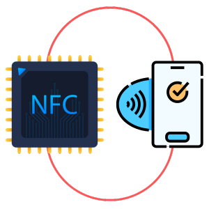

<p align="center">
  <a href="" rel="noopener">
 </a>
</p>

<h3 align="center">NFCEmulator Quickstart</h3>

<div align="center">

[]()


</div>

---


<p align="center"> NFCEmulator Quickstart
    <br> 
</p>

## 📝 Table of Contents

- [📝 Table of Contents](#-table-of-contents)
- [🧐 About ](#-about-)
- [🏁 Getting Started ](#-getting-started-)
  - [Prerequisites ](#prerequisites-)
- [Installation and Update ](#installation-and-update-)
- [⛏️ Running ](#️-running-)
- [⛏️ Built Using ](#️-built-using-)
- [✍️ Authors ](#️-authors-)

## 🧐 About <a name = "about"></a>

This repo contains UI for NFC Device.

## 🏁 Getting Started <a name = "getting_started"></a>

These instructions will get you a copy of the project up and running on your Raspberry Pi/local machine for development and testing purposes. See [deployment](#deployment) for notes on how to deploy the project on a live system.

### Prerequisites <a name = "Prerequisites"></a>

What things you need to install the software and how to install them.

```
- Raspberry Pi Model 3B, 3B+, 4B or CM4
```

- Specify the [GitHub Personal Access Token](https://help.github.com/articles/creating-an-access-token-for-command-line-use/)


## Installation and Update <a name = "Installation_and_Config"></a>

- Once you have the GitHub Personal Access Token execute the following command on the terminal

```bash
export TOKEN=[Replace with GitHub Personal Access Token HERE]
```

You will need to run the following command in order to install or update the NFCEmu
```bash
wget -O -  https://raw.githubusercontent.com/Osman-Ashraf/NFCEmu-QuickStart/main/installer.sh | bash
```
## ⛏️ Running <a name = "test"></a>

1.  The program runs automatically once installed successfully.
2.  
## ⛏️ Built Using <a name = "built_using"></a>

- [Python3](https://www.python.org/) - Raspberry Pi Firmware
- Bash

## ✍️ Authors <a name = "authors"></a>

- [@Nauman3S](https://github.com/Nauman3S) - Development and Deployment
