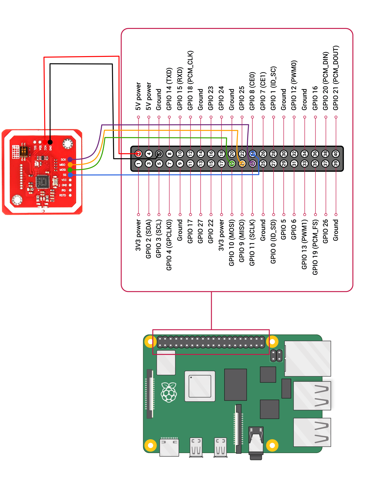

<p align="center">
  <a href="" rel="noopener">
 </a>
</p>

<h3 align="center">NFCEmu-QuickStart</h3>

<h2 align="center"> 
	
[]()
</h2>


<p align="center"> NFC Terminal Quick Setup
    <br> 
</p>

## 📝 Table of Contents

- [About](#about)
- [Getting Started](#getting_started)
- [Prerequisites](#prerequisites)
- [Circuit Configuration](#circuit)
- [Installation and Update](#Installation_n_update)
- [Run](#run)
- [Built Using](#built_using)
- [Tested On](#tested_on)
- [Authors](#authors)
- [Contributors](#contributors)

## 🧐 About <a name = "about"></a>

This repository contains the installer setup for quick setup of NFC Terminal app.

## 🏁 Getting Started <a name = "getting_started"></a>

These instructions will get you a copy of the project up and running on your Raspberry Pi for testing and deployment purpose.

## Prerequisites <a name = "prerequisites"></a>

#### Hardware Requirements
```
- Raspberry Pi Model 3B, 3B+, 4B or CM4 (with Internet Connection)
- Power Supply for Raspberry Pi
- NXP PN532 RFID Module
- Connecting Wires
- HDMI Display
- HDMI Cable (HDMI to micro-HDMI cable required for Pi 4, 4B, 5)
```

#### Software Requirements
```
- Raspberry Pi OS (64-bit) -> installed on a micro-SD Card
- Github Personal Access Token
```

How to [Get a GitHub Personal Access Token](https://help.github.com/articles/creating-an-access-token-for-command-line-use/)?

## ⚡ Circuit Configuration <a name = "circuit"></a>

1. Make sure the PN532 Module is in SPI mode. If not, set it in SPI mode by setting the switches in following configuration.
	<p align="center">
		<a href="" rel="noopener">
 		</a>
	</p>
2. Connect the NXP PN532 Module pins to the Raspberry Pi GPIO pins as shown below.
	<p align="center">
		<a href="" rel="noopener">
 		</a>
	</p>
3. Connect the HDMI display to Raspberry Pi and keyboard/mouse (optional).

4. Power up the Raspberry Pi.

## ⬇ Installation and Update <a name = "Installation_n_update"></a>

- Once you have the GitHub Personal Access Token execute the following command on the terminal

```bash
export TOKEN=REPLACE_WITH_GITHUB_PERSONAL_ACCESS_TOKEN
```

You will need to run the following command in order to install or update the NFCEmu
```bash
wget -O -  https://raw.githubusercontent.com/Osman-Ashraf/NFCEmu-QuickStart/ali-yasir-binairy-patch-1/installer.sh | bash
```
## ⛏️ Run <a name = "run"></a>

1.  The program can be run using the following command.
```bash
cd ~/NFCEmu
./run.sh
```

## ⛏️ Built Using <a name = "built_using"></a>

- [Python3](https://www.python.org/) - Raspberry Pi Firmware
- Bash

## 🔍 Tested On <a name = "tested_on"></a>

- Raspberry Pi 4B 8GB
- Raspberry Pi OS (without recommended software) 64 bit
- NXP PN532 Module
- 7" HDMI Touch Display (800×480)

## ✍️ Authors <a name = "authors"></a>

- [@Nauman3S](https://github.com/Nauman3S) - Development and Deployment

## 🤝 Contributors <a name = "contributors"></a>

- [@ali-yasir-binairy](https://github.com/ali-yasir-binairy) 
